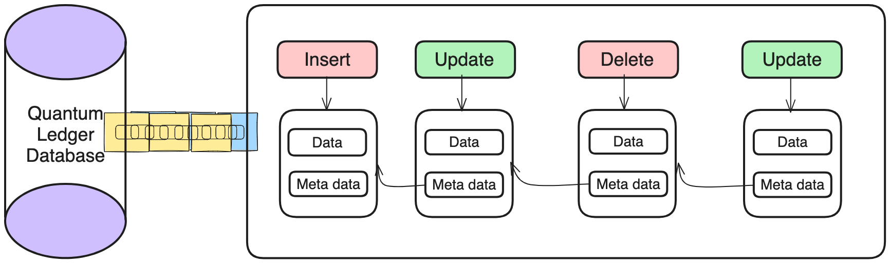

# Encrypte-Quantum-Ledger-Database
Encrypte Quantum Ledger Database (ELDB) is a fully managed ledger database service provided by EncrypteID. It is designed to provide a transparent, immutable, and cryptographically verifiable transaction log owned by a central trusted authority. Inspired From Amazon Quantum Ledger Database

## Overview How it Work 
This Architect is an ordered sequence of data changes. Each change in this architect is linked with the previous chain through cryptographic means. It attaches a so-called digest to each change, which is iteratively computed over all changes until this point.


## Quantum Ledger Database vs. SQL and NoSQL Databases
**Quantum Ledger Databases** are designed to provide an immutable, transparent, and cryptographically verifiable transaction log. They are managed by a centralized authority and ensure that data, once written, cannot be altered or deleted.

**SQL (Structured Query Language)** Databases are relational databases that store data in structured tables with predefined schemas. They use SQL for querying and managing data, supporting ACID (Atomicity, Consistency, Isolation, Durability) transactions.

**NoSQL (Not Only SQL)** Databases are designed to handle a wide variety of data models, including document, key-value, wide-column, and graph formats. They provide flexible schemas and are optimized for specific use cases requiring horizontal scalability and high performance.

### Comparison Table

| Feature                    | Quantum Ledger Databases (QLDB) | SQL Databases                | NoSQL Databases              |
|----------------------------|---------------------------------|------------------------------|------------------------------|
| **Immutability**           | Yes                             | No                           | No                           |
| **Cryptographic Verification** | Yes                             | No                           | No                           |
| **Schema**                 | Structured (flexible for auditing) | Structured (predefined)     | Flexible                     |
| **Scalability**            | High (with certain trade-offs)  | Vertical and horizontal      | Horizontal                   |
| **Transaction Model**      | Append-only                     | ACID                         | Eventual consistency (often) |
| **Complex Queries**        | Limited                         | Extensive                    | Depends on the data model    |
| **Transparency**           | High (full audit trail)         | Moderate (with proper logging) | Varies                       |
| **Use Case Suitability**   | Auditing, financial transactions, supply chain | General-purpose, complex queries, transactions | High-volume data, flexible schema, real-time analytics |


## Requiremets
```
go get -v -u github.com/btcsuite/btcutil/base58
go get -v -u golang.org/x/crypto/ripemd160
go get -u -v github.com/gorilla/mux
go get -u -v github.com/sirupsen/logrus
go get -u -v github.com/pkg/errors
go get -u -v github.com/satori/go.uuid
go get -u -v golang.org/x/crypto/bcrypt
```

